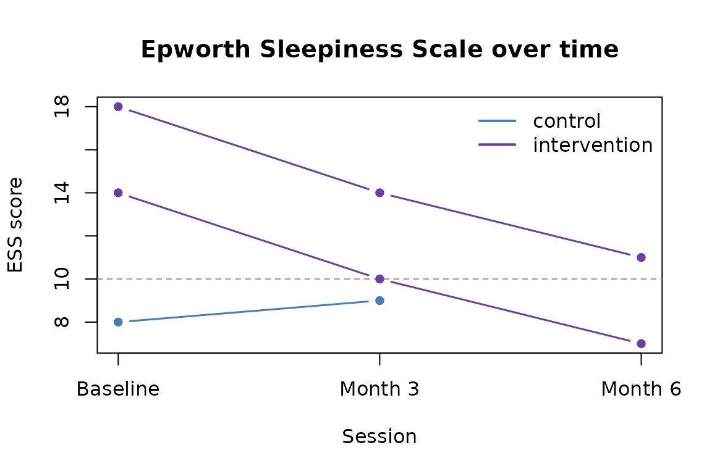

# Longitudinal data in tallieR

Many sleep and circadian studies collect questionnaire data at multiple
time points: a baseline, a post-intervention follow-up, perhaps several
sessions in between. This vignette covers how to work with repeated
administrations in tallieR — retaining full history, monitoring
completion, and preparing data for change-over-time analysis.

## Simulated longitudinal dataset

The bundled example export only has one session per participant. For
this vignette we build a small simulated study with three time points to
illustrate the key functions.

``` r

library(tallieR)

# Helper: make one result entry
.make_result <- function(qid, completed_at, score, answers) {
  list(questionnaire_id = qid, completed_at = completed_at,
       score = score, answers = answers)
}

# Three participants x three sessions (ESS + ISI); P003 misses month-3
study <- structure(
  list(
    files          = "simulated",
    n_participants = 3L,
    participants   = list(
      list(
        meta = list(participant_id = "p1", code = "P001", name = "Alice",
                    age = "28", sex = "female", group = "intervention",
                    session = "baseline", site = "Newcastle",
                    bmi = "", diagnosis = "", medication = "",
                    referral = "", notes = "",
                    created_at = "2026-01-10T09:00:00.000Z"),
        results = list(
          .make_result("ess", "2026-01-10T09:00:00.000Z", 14,
                       list(ess1=2,ess2=2,ess3=1,ess4=3,ess5=2,ess6=1,ess7=2,ess8=1)),
          .make_result("isi", "2026-01-10T09:10:00.000Z", 16,
                       list(isi1=3,isi2=2,isi3=2,isi4=3,isi5=2,isi6=2,isi7=2)),
          .make_result("ess", "2026-04-10T09:00:00.000Z", 10,
                       list(ess1=1,ess2=1,ess3=1,ess4=2,ess5=2,ess6=1,ess7=1,ess8=1)),
          .make_result("isi", "2026-04-10T09:10:00.000Z", 10,
                       list(isi1=2,isi2=1,isi3=1,isi4=2,isi5=2,isi6=1,isi7=1)),
          .make_result("ess", "2026-07-10T09:00:00.000Z",  7,
                       list(ess1=1,ess2=1,ess3=0,ess4=1,ess5=1,ess6=1,ess7=1,ess8=1)),
          .make_result("isi", "2026-07-10T09:10:00.000Z",  6,
                       list(isi1=1,isi2=1,isi3=0,isi4=1,isi5=1,isi6=1,isi7=1))
        )
      ),
      list(
        meta = list(participant_id = "p2", code = "P002", name = "Bob",
                    age = "45", sex = "male", group = "intervention",
                    session = "baseline", site = "Newcastle",
                    bmi = "", diagnosis = "insomnia", medication = "",
                    referral = "", notes = "",
                    created_at = "2026-01-11T10:00:00.000Z"),
        results = list(
          .make_result("ess", "2026-01-11T10:00:00.000Z", 18,
                       list(ess1=3,ess2=2,ess3=2,ess4=3,ess5=2,ess6=2,ess7=2,ess8=2)),
          .make_result("isi", "2026-01-11T10:10:00.000Z", 20,
                       list(isi1=3,isi2=3,isi3=2,isi4=4,isi5=3,isi6=2,isi7=3)),
          .make_result("ess", "2026-04-11T10:00:00.000Z", 14,
                       list(ess1=2,ess2=2,ess3=1,ess4=2,ess5=2,ess6=1,ess7=2,ess8=2)),
          .make_result("isi", "2026-04-11T10:10:00.000Z", 14,
                       list(isi1=2,isi2=2,isi3=2,isi4=3,isi5=2,isi6=1,isi7=2)),
          .make_result("ess", "2026-07-11T10:00:00.000Z", 11,
                       list(ess1=1,ess2=2,ess3=1,ess4=2,ess5=2,ess6=1,ess7=1,ess8=1)),
          .make_result("isi", "2026-07-11T10:10:00.000Z",  9,
                       list(isi1=1,isi2=2,isi3=1,isi4=2,isi5=1,isi6=1,isi7=1))
        )
      ),
      list(
        meta = list(participant_id = "p3", code = "P003", name = "Carol",
                    age = "34", sex = "female", group = "control",
                    session = "baseline", site = "Newcastle",
                    bmi = "", diagnosis = "", medication = "",
                    referral = "", notes = "",
                    created_at = "2026-01-12T11:00:00.000Z"),
        results = list(
          .make_result("ess", "2026-01-12T11:00:00.000Z",  8,
                       list(ess1=1,ess2=1,ess3=1,ess4=1,ess5=1,ess6=1,ess7=1,ess8=1)),
          .make_result("isi", "2026-01-12T11:10:00.000Z",  7,
                       list(isi1=1,isi2=1,isi3=1,isi4=1,isi5=1,isi6=1,isi7=1)),
          # P003 missed the month-3 session
          .make_result("ess", "2026-07-12T11:00:00.000Z",  9,
                       list(ess1=1,ess2=1,ess3=1,ess4=2,ess5=1,ess6=1,ess7=1,ess8=1)),
          .make_result("isi", "2026-07-12T11:10:00.000Z",  8,
                       list(isi1=1,isi2=1,isi3=1,isi4=2,isi5=1,isi6=1,isi7=1))
        )
      )
    )
  ),
  class = "tallier_study"
)
```

## `scores_wide()` vs `scores_long()`

[`scores_wide()`](https://tallier.circadia-lab.uk/reference/scores_wide.md)
keeps only the **most recent** administration per participant per
questionnaire — one row per participant. This is appropriate for
cross-sectional analysis or when you only need a single summary score.

``` r

wide <- scores_wide(study)
wide[, c("code", "group", "ess", "isi")]
#>   code        group ess isi
#> 1 P001 intervention   7   6
#> 2 P002 intervention  11   9
#> 3 P003      control   9   8
```

[`scores_long()`](https://tallier.circadia-lab.uk/reference/scores_long.md)
retains **all administrations** — one row per participant x
questionnaire x session. This is what you need for longitudinal
analysis.

``` r

long <- scores_long(study)
long[, c("code", "group", "questionnaire_id", "completed_at", "score")]
#>    code        group questionnaire_id             completed_at score
#> 1  P001 intervention              ess 2026-01-10T09:00:00.000Z    14
#> 2  P001 intervention              isi 2026-01-10T09:10:00.000Z    16
#> 3  P001 intervention              ess 2026-04-10T09:00:00.000Z    10
#> 4  P001 intervention              isi 2026-04-10T09:10:00.000Z    10
#> 5  P001 intervention              ess 2026-07-10T09:00:00.000Z     7
#> 6  P001 intervention              isi 2026-07-10T09:10:00.000Z     6
#> 7  P002 intervention              ess 2026-01-11T10:00:00.000Z    18
#> 8  P002 intervention              isi 2026-01-11T10:10:00.000Z    20
#> 9  P002 intervention              ess 2026-04-11T10:00:00.000Z    14
#> 10 P002 intervention              isi 2026-04-11T10:10:00.000Z    14
#> 11 P002 intervention              ess 2026-07-11T10:00:00.000Z    11
#> 12 P002 intervention              isi 2026-07-11T10:10:00.000Z     9
#> 13 P003      control              ess 2026-01-12T11:00:00.000Z     8
#> 14 P003      control              isi 2026-01-12T11:10:00.000Z     7
#> 15 P003      control              ess 2026-07-12T11:00:00.000Z     9
#> 16 P003      control              isi 2026-07-12T11:10:00.000Z     8
```

## Monitoring completion across time points

[`completion_summary()`](https://tallier.circadia-lab.uk/reference/completion_summary.md)
shows which participants have data for which questionnaires:

``` r

completion_summary(study)[, c("code", "questionnaire_id", "completed", "completed_at")]
#>   code questionnaire_id completed             completed_at
#> 1 P001              ess      TRUE 2026-07-10T09:00:00.000Z
#> 2 P001              isi      TRUE 2026-07-10T09:10:00.000Z
#> 3 P002              ess      TRUE 2026-07-11T10:00:00.000Z
#> 4 P002              isi      TRUE 2026-07-11T10:10:00.000Z
#> 5 P003              ess      TRUE 2026-07-12T11:00:00.000Z
#> 6 P003              isi      TRUE 2026-07-12T11:10:00.000Z
```

The wide format gives a cleaner at-a-glance matrix:

``` r

completion_summary(study, wide = TRUE)[, c("code", "group", "ess", "isi")]
#>   code        group  ess  isi
#> 1 P001 intervention TRUE TRUE
#> 2 P002 intervention TRUE TRUE
#> 3 P003      control TRUE TRUE
```

P003 missed the month-3 session but has baseline and month-6 data.
[`completion_summary()`](https://tallier.circadia-lab.uk/reference/completion_summary.md)
reports whether each questionnaire has *any* completed administration —
for session-level monitoring, filter
[`scores_long()`](https://tallier.circadia-lab.uk/reference/scores_long.md)
by timestamp.

## Preparing a panel data frame

For longitudinal modelling you typically want a session number alongside
each score. Derive it from the timestamp by numbering administrations in
chronological order:

``` r

long <- scores_long(study)

# Number administrations per participant x questionnaire
long <- long[order(long$participant_id, long$questionnaire_id, long$completed_at), ]
long$session_n <- ave(
  seq_len(nrow(long)),
  paste(long$participant_id, long$questionnaire_id),
  FUN = seq_along
)

head(long[, c("code", "group", "questionnaire_id", "session_n",
              "completed_at", "score")])
#>   code        group questionnaire_id session_n             completed_at score
#> 1 P001 intervention              ess         1 2026-01-10T09:00:00.000Z    14
#> 3 P001 intervention              ess         2 2026-04-10T09:00:00.000Z    10
#> 5 P001 intervention              ess         3 2026-07-10T09:00:00.000Z     7
#> 2 P001 intervention              isi         1 2026-01-10T09:10:00.000Z    16
#> 4 P001 intervention              isi         2 2026-04-10T09:10:00.000Z    10
#> 6 P001 intervention              isi         3 2026-07-10T09:10:00.000Z     6
```

Pivot to wide-by-session for repeated-measures ANOVA or mixed models:

``` r

ess_long        <- long[long$questionnaire_id == "ess", ]
ess_long$score  <- as.numeric(ess_long$score)

ess_wide <- tidyr::pivot_wider(
  ess_long[, c("code", "group", "session_n", "score")],
  names_from  = "session_n",
  values_from = "score",
  names_prefix = "ess_t"
)

ess_wide
#> # A tibble: 3 × 5
#>   code  group        ess_t1 ess_t2 ess_t3
#>   <chr> <chr>         <dbl>  <dbl>  <dbl>
#> 1 P001  intervention     14     10      7
#> 2 P002  intervention     18     14     11
#> 3 P003  control           8      9     NA
```

## Plotting change over time

With
[`scores_long()`](https://tallier.circadia-lab.uk/reference/scores_long.md)
and a session number, plotting individual trajectories is
straightforward:

``` r

long$score     <- as.numeric(long$score)
long$session_n <- as.integer(long$session_n)

ess     <- long[long$questionnaire_id == "ess", ]
palette <- c(control = "#4A7BB5", intervention = "#6B3FA0")

plot(
  range(ess$session_n), range(ess$score, na.rm = TRUE),
  type = "n", xlab = "Session", ylab = "ESS score",
  main = "Epworth Sleepiness Scale over time",
  xaxt = "n"
)
axis(1, at = 1:3, labels = c("Baseline", "Month 3", "Month 6"))
abline(h = 10, lty = 2, col = "grey60")   # ESS clinical threshold

for (pid in unique(ess$participant_id)) {
  p   <- ess[ess$participant_id == pid, ]
  grp <- p$group[1]
  lines(p$session_n, p$score,
        col = palette[grp], lwd = 1.5, type = "b", pch = 16)
}
legend("topright", legend = names(palette),
       col = palette, lwd = 2, bty = "n")
```



## Adding clinical interpretations

Join
[`interpret_all()`](https://tallier.circadia-lab.uk/reference/interpret_all.md)
to
[`scores_long()`](https://tallier.circadia-lab.uk/reference/scores_long.md)
to add a `label` column alongside each score:

``` r

interps       <- interpret_all(study)
interps$score <- as.numeric(interps$score)

result <- merge(
  long[, c("participant_id", "code", "group", "questionnaire_id",
           "session_n", "completed_at", "score")],
  interps[, c("participant_id", "questionnaire_id", "completed_at",
              "label", "color")],
  by  = c("participant_id", "questionnaire_id", "completed_at"),
  all.x = TRUE
)

result[result$questionnaire_id == "ess",
       c("code", "group", "session_n", "score", "label")]
#>    code        group session_n score      label
#> 1  P001 intervention         1    14  Excessive
#> 2  P001 intervention         2    10  Excessive
#> 3  P001 intervention         3     7     Normal
#> 7  P002 intervention         1    18     Severe
#> 8  P002 intervention         2    14  Excessive
#> 9  P002 intervention         3    11  Excessive
#> 13 P003      control         1     8 Borderline
#> 14 P003      control         2     9 Borderline
```
